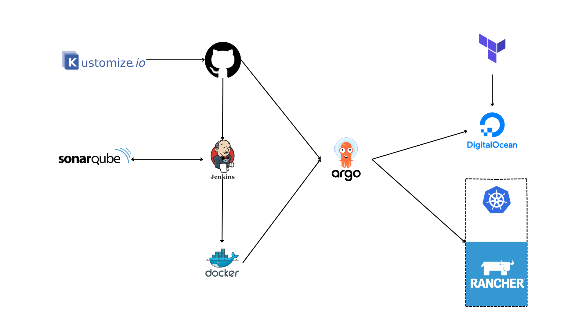
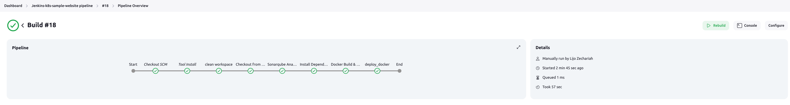
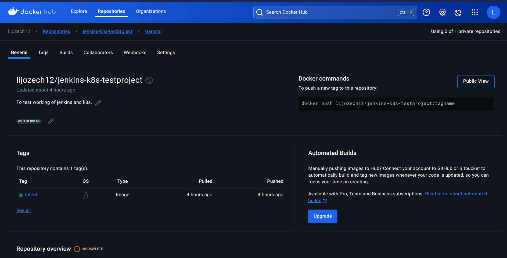
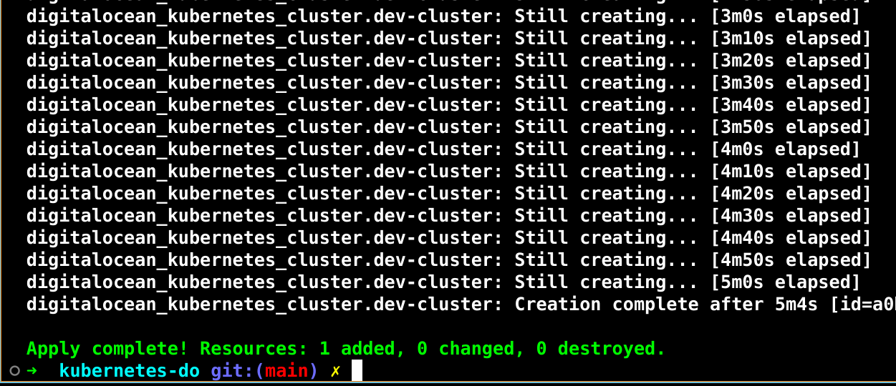
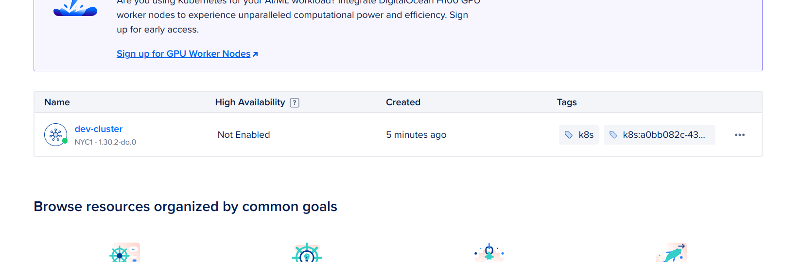
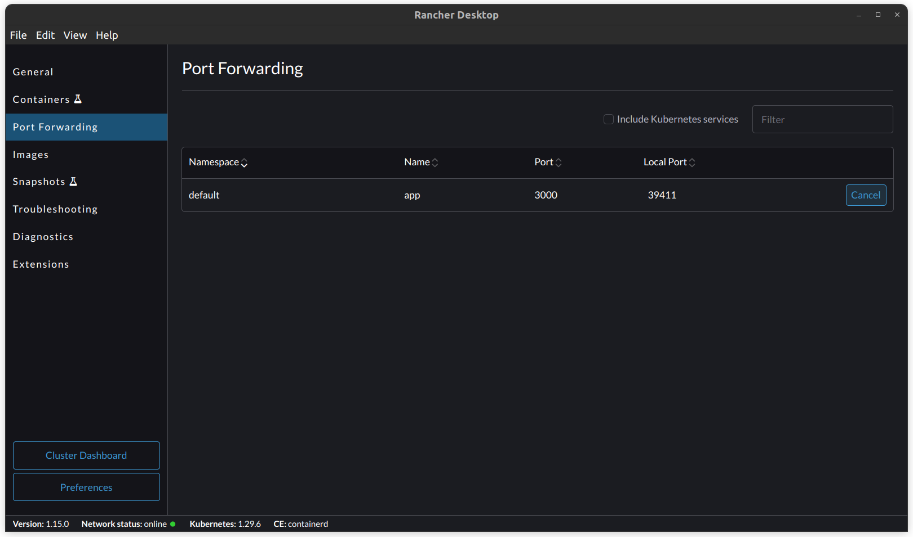
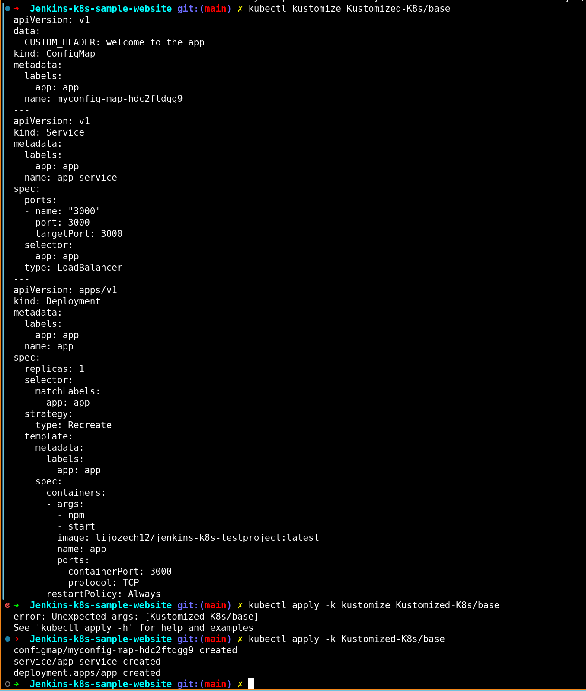
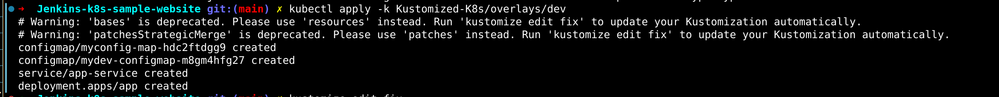
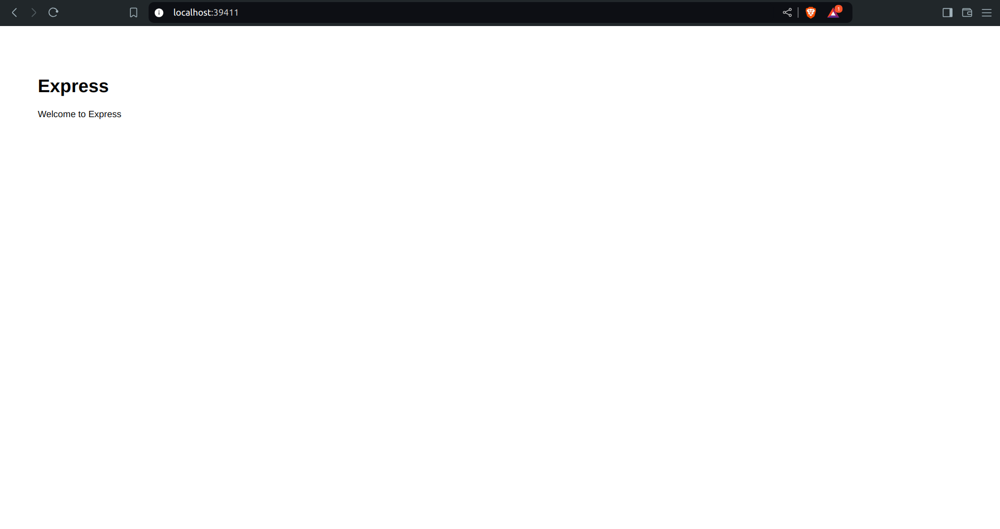

# Jenkins-K8s-Sample-Website

This project demonstrates the integration and usage of Kubernetes, Jenkins, and SonarQube. The goal is to analyze code using SonarQube, build and tag a Docker image, push it to Docker Hub, and deploy a sample web application on a Kubernetes cluster created using Rancher Desktop on a personal computer.



## Project Setup

### Prerequisites
- Jenkins installed on your personal computer
- SonarQube connected to Jenkins
- Rancher Desktop installed
- GitHub repository containing the pipeline script, Dockerfile, and all necessary files
- Docker Hub account for storing Docker images

### Steps

1. **Install Jenkins**
   - Install Jenkins on your personal laptop.
   - Configure Jenkins with necessary plugins (e.g., Docker, Kubernetes, SonarQube Scanner).

2. **Install SonarQube**
   - Install SonarQube and connect it to Jenkins.
   - Configure the SonarQube server details in Jenkins global tool configuration.

3. **Configure Docker Hub**
   - Add Docker Hub credentials to Jenkins for storing Docker images.

4. **Pipeline and Docker Setup**
   - Create a Jenkins Pipeline script and Dockerfile.
   - Store these files in your GitHub repository.
   - Add your GitHub repository credentials to Jenkins.

5. **Install Rancher Desktop**
   - Install Rancher Desktop to manage Kubernetes on your personal computer.

6. **Install Terraform**
   - It is used to create k8s cluster in digitalocean.


7. **Create Deployment**
   - Use the Docker image to create a deployment in the Rancher Kubernetes cluster or Digital ocean cluster.

## Jenkins Pipeline

This pipeline ensures continuous integration and continuous deployment (CI/CD) by automating the entire process from code checkout to deployment in a Docker container, making the development workflow efficient and reliable.




## Docker hub

We are Storing the image we created during Jenkins pipeline here in the docker hub.



## Terraform to create Kuberenetes infra in digital ocean.

To create k8s infra in digital ocean create an api token in digital ocean and run the below command.

```bash
export DO_PAT=<api token>
```
Then run the below commands to create the digital ocean cluster

```bash
terraform apply -var "do_token=${DO_PAT}"
```





## Normal Deployment. 

We can deploy k8s application using this below
```bash
kubectl apply -f app-deployment.yaml,app-service.yaml
```


Used to deploy the images we created and stored in Docker hub. It will pull the image and create the deployment. Using the service it will make it visible on port 3000 of the pod.


After This for Rancher port forwarding to forward the port 3000 from pod to port in my computer.



## Deployment using Kustomize

Kustomize will help to create a package of k8s deployment. We can easily deploy the k8s resources using that. Run the below commands to kustomize 
```bash
kubectl kustomize Kustomized-K8s/base #it will kustomize the deployment and everything

kubectl apply -k kustomize Kustomized-K8s/base

```



Kustomization for development environment.

```bash
kubectl apply -k Kustomized-K8s/overlays/dev
```



Also for Production deployment just change dev to prod

## Argo CD

Follow [Installation](https://argo-cd.readthedocs.io/en/stable/getting_started/) documentation to install Argo CD in your cluster.

Argo CD will help to continuously deploy changes pushed into github in the Kuberentes cluster.
After installing it Specify the github repo and it's path(In our case Kustomized-K8s). It will take the code from repo and deploy it in our cluster.

Also there is another way to do using argocd cli.


## Result

It's very basic webpage. Since My focus was to use these tools and learn it's working.



