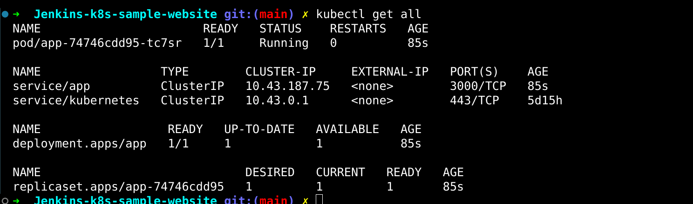

# Jenkins-K8s-Sample-Website

This project demonstrates the integration and usage of Kubernetes, Jenkins, and SonarQube. The goal is to analyze code using SonarQube, build and tag a Docker image, push it to Docker Hub, and deploy a sample web application on a Kubernetes cluster created using Rancher Desktop on a personal computer.

## Project Setup

### Prerequisites
- Jenkins installed on your personal computer
- SonarQube connected to Jenkins
- Rancher Desktop installed
- GitHub repository containing the pipeline script, Dockerfile, and all necessary files
- Docker Hub account for storing Docker images

### Steps

1. **Install Jenkins**
   - Install Jenkins on your personal laptop.
   - Configure Jenkins with necessary plugins (e.g., Docker, Kubernetes, SonarQube Scanner).

2. **Install SonarQube**
   - Install SonarQube and connect it to Jenkins.
   - Configure the SonarQube server details in Jenkins global tool configuration.

3. **Install Rancher Desktop**
   - Install Rancher Desktop to manage Kubernetes on your personal computer.

4. **Pipeline and Docker Setup**
   - Create a Jenkins Pipeline script and Dockerfile.
   - Store these files in your GitHub repository.
   - Add your GitHub repository credentials to Jenkins.

5. **Configure Docker Hub**
   - Add Docker Hub credentials to Jenkins for storing Docker images.

6. **Create Deployment**
   - Use the Docker image to create a deployment in your Rancher Kubernetes cluster.

## Repository Structure

├── Jenkinsfile
├── Dockerfile
├── README.md
├── app.js
├── docker-compose.yaml
├── package-lock.json
├── package.json
├── node_modules/
├── public/
├── routes/
│   ├── index.js
│   ├── users.js
├── views/
│   ├── error.jade
│   ├── index.jade
├── Kubernetes_file/
│   ├── app-deployment.yaml
│   ├── app-service.yaml

## Jenkins Pipeline

This pipeline ensures continuous integration and continuous deployment (CI/CD) by automating the entire process from code checkout to deployment in a Docker container, making the development workflow efficient and reliable.

## Docker hub

We are Storing the image we created during Jenkins pipeline here in the docker hub.

## Kuberenetes 

Used to deploy the images we created and stored in Docker hub. It will pull the image and create the deployment. Using the service it will make it visible on port 3000 of the pod.

After This I used Rancher port forwarding to forward the port 3000 from pod to port in my computer.

## Result

It's very basic webpage. Since My focus was to use these tools and learn it's working.

